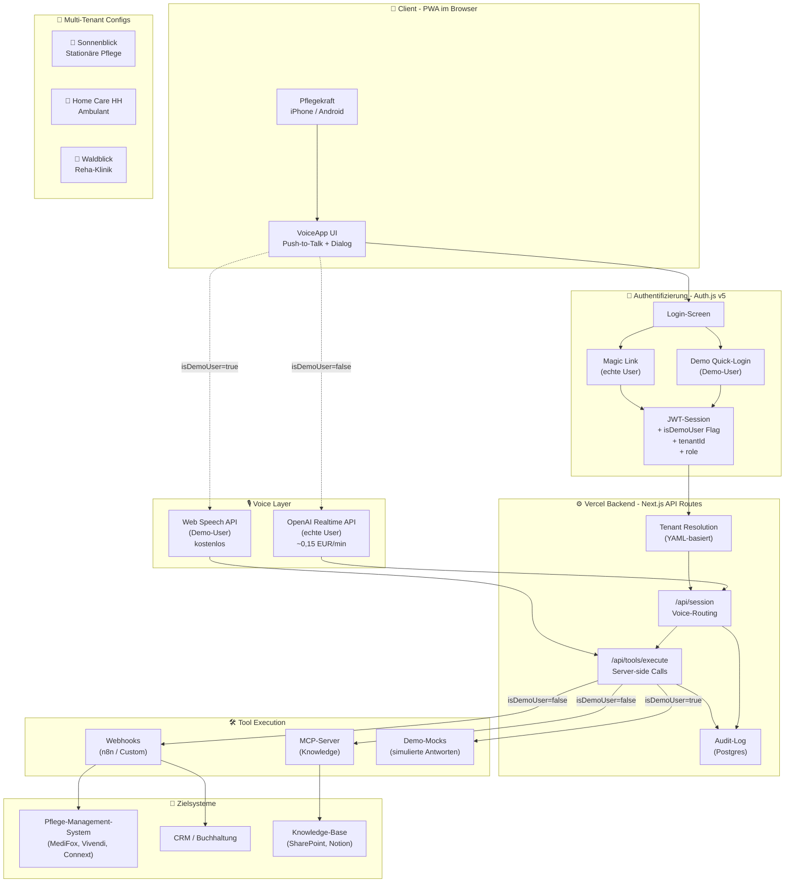
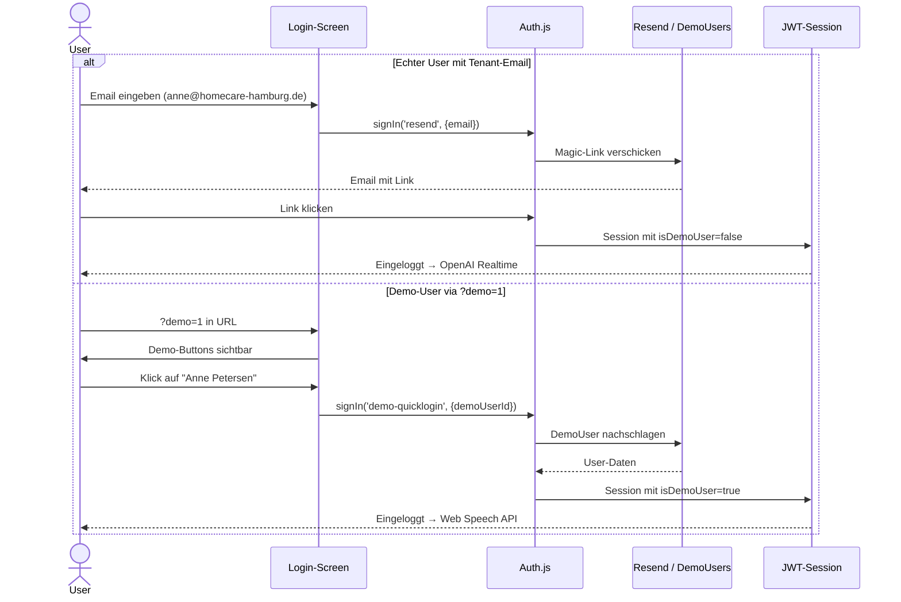
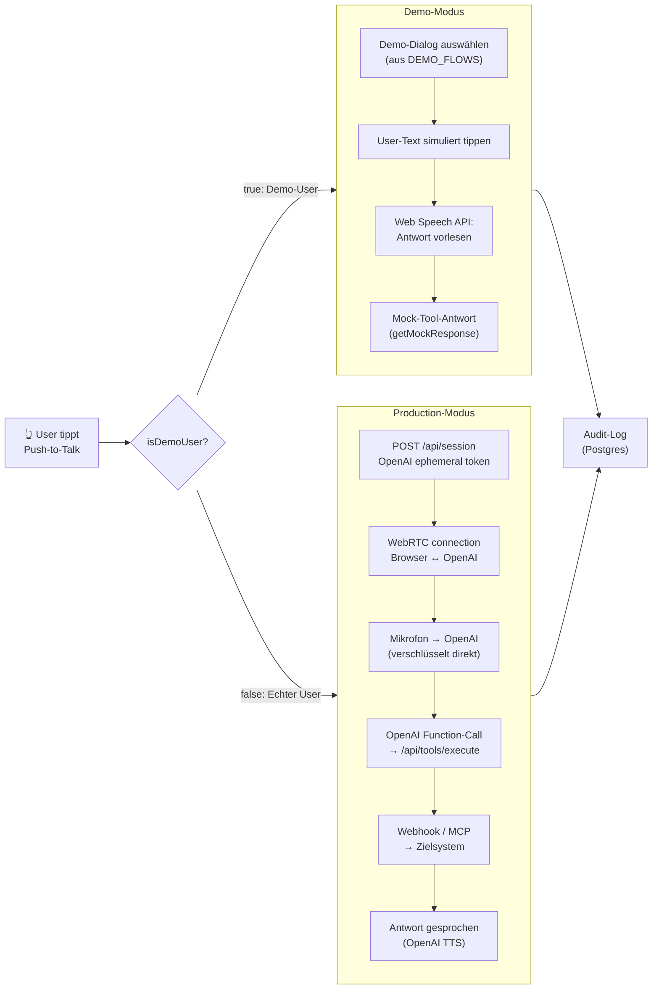

# Anni — deine persönliche Assistentin

> Voice-First Sprach-Assistentin für Pflegekräfte. Multi-Tenant SaaS mit drei Demo-Pflegeeinrichtungen (Pflegeheim, ambulante Pflege, Reha-Klinik).

**Deployment-Modell (Variante C):** Eine URL, beide Login-Wege parallel. Magic Link via Email für echte User → OpenAI Realtime API. Demo-Quick-Login für eigene Demos → Web Speech API (kostenlos). Pro User wird in der JWT-Session entschieden, welcher Voice-Stack aktiv ist.

---

## Inhalt

- [Quickstart lokal](#quickstart-lokal)
- [Deployment-Anleitung](#deployment-anleitung)
  - [Phase 1: Code zu GitHub](#phase-1-code-zu-github)
  - [Phase 2: Vercel-Projekt erstellen](#phase-2-vercel-projekt-erstellen)
  - [Phase 3: Postgres-Datenbank](#phase-3-postgres-datenbank)
  - [Phase 4: Magic Link Email](#phase-4-magic-link-email-einrichten)
  - [Phase 5: OpenAI Realtime API](#phase-5-openai-realtime-api)
  - [Phase 6: Eigene Domain (optional)](#phase-6-eigene-domain-optional)
- [Feature-Übersicht](#feature-übersicht)
  - [Aktueller Stand](#aktueller-stand-deployt)
  - [Roadmap](#ausbau-roadmap)
  - [Bewusst nicht im Scope](#bewusst-nicht-im-scope)
- [Systemarchitektur](#systemarchitektur)
- [Tenants & Demo-User](#tenants--demo-user)
- [Tech Stack](#tech-stack)
- [Troubleshooting](#troubleshooting)

---

## Quickstart lokal

```bash
# Dependencies installieren
npm install

# .env.local anlegen
cp .env.example .env.local

# AUTH_SECRET generieren und in .env.local eintragen
openssl rand -base64 32

# Development server starten
npm run dev
```

App läuft auf `http://localhost:3000`. Demo-Login mit `?demo=1` oder `DEMO_LOGIN_VISIBLE=true` in `.env.local`.

---

## Deployment-Anleitung

Schritt für Schritt von Null zur lauffähigen Vercel-App mit Demo- und Production-Modus parallel.

**Geschätzte Setup-Zeit:**

| Modus | Dauer |
|---|---|
| Demo-only (ohne API-Keys) | ~15 Minuten |
| Mit Magic Link Email | +10 Minuten (Resend-Setup) |
| Mit OpenAI Realtime Voice | +5 Minuten (OpenAI-Account) |

### Was du am Ende haben wirst

Eine lauffähige Vercel-Deployment-URL (z.B. `anni.vercel.app`), bei der:

1. Magic Link Login funktioniert
2. Demo-Quick-Login funktioniert
3. Drei Pflege-Tenants konfiguriert sind
4. Audit-Log in Postgres läuft
5. Optional OpenAI Realtime aktiv ist

### Voraussetzungen

- **GitHub-Account** — kostenlos auf [github.com](https://github.com)
- **Vercel-Account** — kostenlos auf [vercel.com](https://vercel.com), Login mit GitHub empfohlen
- **Git** auf deinem Rechner — bei Mac/Linux meist vorinstalliert, Windows: [git-scm.com](https://git-scm.com)
- **Optional: Resend-Account** für Magic-Link-Emails — kostenlos für 3000 Mails/Monat auf [resend.com](https://resend.com)
- **Optional: OpenAI-Account** mit Realtime-API-Zugang — [platform.openai.com](https://platform.openai.com), rechne mit ~0,15 EUR pro Minute aktive Voice-Zeit

> 💡 **Tipp:** Du kannst die App zuerst nur im Demo-Modus deployen (ohne Resend, ohne OpenAI). Sobald die Demo läuft und du echte Pilotkunden hast, fügst du die Production-Komponenten dazu.

---

### Phase 1: Code zu GitHub

#### 1.1 Code lokal entpacken

Du hast eine Datei `anni-app.zip` erhalten. Entpacke sie an einen Ort deiner Wahl:

```bash
cd ~/Projekte
unzip anni-app.zip
cd anni-app
```

#### 1.2 Git-Repository initialisieren

```bash
git init
git add .
git commit -m "Initial commit: Anni"
```

#### 1.3 GitHub-Repository anlegen

1. Auf [github.com](https://github.com) einloggen, oben rechts auf Plus-Icon klicken, **New repository** wählen.
2. Repository-Name: `anni` (oder beliebig). Privat oder öffentlich, beides funktioniert auf Vercel.
3. **Wichtig:** README, .gitignore, License unchecked lassen — der Code bringt das schon mit.
4. **Create repository** klicken.

GitHub zeigt dir jetzt die Befehle, um lokales Repo zu pushen:

```bash
git remote add origin https://github.com/DEIN-USERNAME/anni.git
git branch -M main
git push -u origin main
```

> ⚠️ **Wenn etwas schief geht:** Falls `git push` mit "Permission denied" fehlschlägt, brauchst du SSH-Keys oder ein Personal Access Token. GitHub bietet beim Push eine Anleitung. Alternativ: GitHub Desktop App nutzen.

---

### Phase 2: Vercel-Projekt erstellen

#### 2.1 Vercel-Account verbinden

1. Zu [vercel.com](https://vercel.com) gehen, mit GitHub einloggen.
2. Beim ersten Login: Vercel fragt nach GitHub-Berechtigungen. Erlaube den Zugriff auf alle Repos, oder wähle gezielt das `anni`-Repo.

#### 2.2 Projekt importieren

1. Im Vercel Dashboard: **Add New** Button oben rechts, dann **Project**.
2. Liste der GitHub-Repos erscheint. `anni` anklicken, **Import**.
3. Vercel erkennt Next.js automatisch. Framework Preset: Next.js. Root Directory: leer lassen.
4. Build & Output Settings: Default-Werte beibehalten.

#### 2.3 Environment Variables — erste Runde

Im Import-Dialog gibt es einen Bereich **Environment Variables**. Trage erstmal nur die zwingend benötigten Werte ein:

| Variable | Wert |
|---|---|
| `AUTH_SECRET` | Lokal generieren mit `openssl rand -base64 32` und den ganzen Output hier eintragen |
| `AUTH_URL` | Vorerst leer lassen — Vercel setzt das automatisch nach dem ersten Deploy |
| `DEMO_LOGIN_VISIBLE` | `true` (Demo-Buttons sichtbar) oder `false` (Demo-Buttons nur per `?demo=1`) |

> 💡 **AUTH_SECRET generieren:** Auf Mac/Linux Terminal öffnen, `openssl rand -base64 32` ausführen. Auf Windows: Git Bash öffnen und denselben Befehl ausführen.

#### 2.4 Erstes Deployment

1. **Deploy** Button klicken.
2. Vercel baut die App (1-3 Minuten).
3. Nach erfolgreichem Build: Vercel zeigt eine URL wie `anni-xyz.vercel.app`.
4. URL öffnen — Login-Screen erscheint. Aber: Login funktioniert noch nicht, weil die Postgres-DB fehlt.

> ⚠️ **Wenn der Build fehlschlägt:** Schau dir die Build-Logs in Vercel an. Häufigste Ursachen: Tippfehler in Env-Variablen, oder Node-Version-Konflikt. In den Project Settings → General → Node.js Version auf 20.x setzen.

---

### Phase 3: Postgres-Datenbank

Vercel Postgres wurde Ende 2024 zu Neon migriert. Die App nutzt den **Neon Serverless Driver** (`@neondatabase/serverless`), der HTTP-basiert arbeitet und perfekt für serverless Environments funktioniert.

#### 3.1 Neon-DB anlegen

1. Im Vercel-Projekt-Dashboard: **Storage** Tab oben.
2. **Create Database** klicken, **Neon (Postgres)** aus dem Marketplace wählen.
3. Name: `anni-db` (oder beliebig). Region: **Frankfurt** wählen für EU-Datenresidenz.
4. **Create** klicken.
5. Vercel fragt: "Connect to project?" — `anni` wählen, **Connect**.

Vercel setzt jetzt automatisch die `DATABASE_URL` (und legacy `POSTGRES_URL`) Environment-Variablen. Du musst nichts manuell eintragen.

#### 3.2 Re-Deployment

Damit die App die neuen Env-Variablen sieht, muss neu deployt werden:

1. **Deployments** Tab oben.
2. Letztes Deployment finden, drei-Punkte-Menü, **Redeploy**.
3. **Redeploy** im Bestätigungsdialog klicken.

Nach 1-2 Minuten ist die App neu deployt — jetzt mit Postgres-Verbindung. Audit-Log wird ab jetzt persistiert.

#### 3.3 Demo-Modus testen

Öffne deine Vercel-URL mit `?demo=1` angehängt:

```
https://anni-xyz.vercel.app/login?demo=1
```

Du siehst jetzt den Demo-Schnellzugang-Button. Klick rein, wähle einen Demo-User. Die App lädt, du kannst tippen und ein simulierter Demo-Dialog läuft mit hörbarer Sprachausgabe.

> ✅ **Glückwunsch!** Die App läuft jetzt auf Vercel im Demo-Modus. Du kannst die URL bereits Pilotkunden zeigen. Die nächsten Phasen ergänzen Magic Link Email (für echte User) und OpenAI Realtime (für echte Voice-Qualität).

---

### Phase 4: Magic Link Email einrichten

Damit echte User mit ihrer Email-Adresse einloggen können, brauchst du einen Email-Versand-Provider. Wir nutzen Resend (Free Tier: 3000 Mails/Monat).

#### 4.1 Resend-Account anlegen

1. Auf [resend.com](https://resend.com) gehen, kostenlos registrieren.
2. Email-Verifikation, dann Login.
3. Im Dashboard: **API Keys** im Menü.
4. **Create API Key** klicken. Name: "Anni Production". Permission: **Sending access**. Domain: **All**.
5. **Wichtig:** Der API-Key wird nur einmal angezeigt. Sofort an einen sicheren Ort kopieren.

#### 4.2 Absender-Email konfigurieren

Zwei Optionen:

- **Schnell-Variante:** Resend-Test-Domain nutzen (`onboarding@resend.dev`). Funktioniert sofort, sieht aber nicht professionell aus für Pilotkunden.
- **Production-Variante:** Eigene Domain in Resend verifizieren. Du brauchst Zugriff auf die DNS-Einträge deiner Domain. Dauer: 10-30 Minuten je nach DNS-Provider.

> Empfehlung: Für die ersten Pilotgespräche reicht `onboarding@resend.dev`. Sobald echte Pilotkunden da sind, eigene Domain einrichten.

#### 4.3 Vercel Environment Variables erweitern

1. Vercel Dashboard → dein Projekt → **Settings** Tab → **Environment Variables**.
2. **Add New** für jede Variable:

| Variable | Wert |
|---|---|
| `RESEND_API_KEY` | Der API-Key aus 4.1 (beginnt mit `re_`) |
| `EMAIL_FROM` | `onboarding@resend.dev` (Test) oder `noreply@deine-domain.de` (Production) |

3. Re-Deployment auslösen wie in 3.2.

#### 4.4 Magic Link testen

Auf der Login-Seite eine der konfigurierten Tenant-Emails eingeben (z.B. `anne@homecare-hamburg.de` — du kannst eine Email einsetzen, auf die du tatsächlich Zugriff hast). Klick **Anmelde-Link erhalten**.

Email kommt nach wenigen Sekunden im Posteingang (eventuell Spam-Ordner prüfen). Klick auf den Link — du bist eingeloggt.

> ⚠️ **Tenant-Domains anpassen:** Die Demo-Tenants haben fiktive Email-Domains (`sonnenblick.de`, `homecare-hamburg.de`, `reha-waldblick.de`). Für ECHTE Pilotkunden musst du die `tenants/*.yaml` Dateien anpassen und die echte Domain hinzufügen, dann pushen, dann re-deployen.

---

### Phase 5: OpenAI Realtime API

Diese Phase aktiviert die echte Voice-Qualität für echte User. Demo-User bleiben weiterhin auf Web Speech API — der Switch passiert pro User auf Server-Seite.

#### 5.1 OpenAI-Account und Realtime-Zugang

1. Auf [platform.openai.com](https://platform.openai.com) einloggen oder registrieren.
2. **Settings → Billing** — Zahlungsmethode hinterlegen. Realtime API ist nicht im Free Tier.
3. Mindestens 5-10 EUR Guthaben aufladen für erste Tests.
4. **API Keys** Tab — neuen Key erstellen, kopieren, sicher speichern.

> ⚠️ **Kosten-Hinweis:** OpenAI Realtime API kostet aktuell ca. 0,06 USD pro Minute Audio-Input und 0,24 USD pro Minute Audio-Output. Insgesamt **~0,15 EUR pro Minute aktive Voice-Konversation**. Für eine 30-Minuten-Pilotkunden-Demo: ~5 EUR. Setze ein monatliches Budget-Limit in OpenAI Settings, damit du nicht überzahlst.

#### 5.2 Vercel Variable hinzufügen

1. Vercel Settings → Environment Variables.
2. **Add New**: Name `OPENAI_API_KEY`, Wert der Key (beginnt mit `sk-`).
3. Re-Deployment auslösen.

#### 5.3 Production-Voice testen

Mit einer ECHTEN Tenant-Email einloggen (Magic Link). Nach Login auf den großen Mikrofon-Button tippen — Browser fragt nach Mikrofon-Zugriff. Erlauben.

Sprich frei. Beispiel: "Frau Müller, Blutdruck 130 zu 85." — Anni transkribiert deine Sprache, antwortet, und ruft das passende Tool auf. Latenz: typisch 1-2 Sekunden.

> 💡 **Demo-User bleibt im Demo-Modus:** Wenn du gleichzeitig mit einem Demo-User eingeloggt bist (z.B. in einem zweiten Browser-Fenster), nutzt der weiterhin Web Speech API. Pro Session wird im JWT-Token entschieden, welcher Voice-Stack aktiv ist.

---

### Phase 6: Eigene Domain (optional)

Für Pilotkunden-Gespräche wirkt eine eigene Domain (z.B. `anni.deine-firma.de`) deutlich professioneller als `anni-xyz.vercel.app`.

#### 6.1 Domain in Vercel hinzufügen

1. Vercel Settings → **Domains**.
2. Eigene Domain eintragen, **Add** klicken.
3. Vercel zeigt DNS-Einträge, die du beim Domain-Provider setzen musst.
4. DNS-Einträge eintragen, 5-30 Minuten warten bis Vercel die Domain aktiviert.

#### 6.2 AUTH_URL aktualisieren

> ⚠️ **Wichtig:** Damit Magic Link Login mit der neuen Domain funktioniert, musst du `AUTH_URL` aktualisieren:

1. Vercel Settings → Environment Variables.
2. `AUTH_URL` bearbeiten: Wert auf `https://anni.deine-domain.de` setzen.
3. Re-Deployment.

---

## Feature-Übersicht

### Aktueller Stand (deployt)

Diese Features sind im aktuellen Deployment vollständig funktional und produktiv nutzbar.

#### Authentifizierung

| Feature | Beschreibung |
|---|---|
| **Magic Link Email** | Passwortloser Login per Email-Link über Resend |
| **Demo Quick-Login** | Drei vordefinierte Demo-User für sofortigen Zugang ohne Email-Verifikation, sichtbar via `?demo=1` |
| **Tenant-Auflösung** | Email-Domain entscheidet, zu welcher Einrichtung der User gehört |
| **Persistente Session** | 90 Tage gültige JWT-Session, User bleibt eingeloggt bis aktiver Logout |
| **Rollen-System** | Pro Tenant definierte Rollen, Tools rollenbasiert freigeschaltet |

#### Voice-Interaktion

| Feature | Beschreibung |
|---|---|
| **Push-to-Talk** | Audio nur auf User-Trigger (Tap, Spacebar, AirPods). Kein Always-On |
| **OpenAI Realtime API** | Production-Voice für echte User. Sub-Sekunden-Latenz, native Function-Calling |
| **Web Speech API Fallback** | Demo-User nutzen Browser-eingebaute TTS, kostenlos |
| **Visuelle Begleitung** | Dialog-Verlauf wird live geschrieben, Tool-Calls werden transparent angezeigt |
| **Modeless Tool-Routing** | KI entscheidet selbst, welches Tool aufgerufen wird |

#### Multi-Tenant-Konfiguration

| Feature | Beschreibung |
|---|---|
| **YAML-basierte Configs** | Pro Tenant eine YAML-Datei mit Branding, Tools, Persona, Rollen, Compliance |
| **Custom Branding** | Pro Tenant eigene Farben, Logo-Emoji, App-Name, Greeting, Tagline |
| **Tool-Catalog** | Pro Tenant 8-10 vordefinierte Tools, je Industrie verschieden |
| **3 Demo-Tenants** | Sonnenblick (Pflegeheim), Home Care Hamburg (ambulant), Waldblick (Reha) — alle voll konfiguriert |

#### Tools und Backend

| Feature | Beschreibung |
|---|---|
| **Server-side Tool-Execution** | Alle Tool-Aufrufe gehen über Vercel-Backend. Webhook-URLs und Auth bleiben geheim |
| **Webhook-Tools** | HTTP POST zu konfigurierten URLs (n8n, Custom-Backend, etc.) |
| **MCP-Tools (Stub)** | Knowledge-Queries als MCP-Server, aktuell als Webhook implementiert |
| **Demo-Mocks** | Realistische Mock-Antworten pro Tenant und Tool für Demo-User |
| **Audit-Log** | Postgres-basiert, alle Tool-Calls und Sessions werden persistiert |

#### UX und Design

| Feature | Beschreibung |
|---|---|
| **Wellbeing-Stil** | Hell, einladend, weich. Pflege-Profis-tauglich, kein "Tech-Look" |
| **Mobile-First** | PWA, optimiert für iPhone/Android, iOS Safari Bug-Fix für Footer |
| **Tenant-spezifische Farbgebung** | Sonnenblick: warmes Gelb. Home Care: Bordeaux. Waldblick: Sky-Blau |
| **AirPods/Headset-Support** | Push-to-Talk via Media Session API. Spacebar als Tastatur-Trigger |

### Ausbau-Roadmap

Diese Features sind nicht im aktuellen Deployment, aber architektonisch vorbereitet und können schrittweise ergänzt werden.

#### Kurzfristig (1-3 Monate)

- **Echte Webhook-Tool-Integrationen** — n8n-Workflows oder Custom-Backends an die konfigurierten Tool-URLs anbinden. Pro Pilotkunde 2-3 echte Tools.
- **Eigene Resend-Domain** — Magic Link Mails kommen von `noreply@deine-domain.de` statt von `resend.dev`.
- **Tool-Confirmation-Flow** — Bei kritischen Tools (Notruf, Schichtleitung-Alarm) verbale Bestätigung erzwingen.
- **Audit-Log Admin-View** — Web-UI für Tenant-Admins zum Einsehen der Audit-Einträge.
- **PWA-Installation** — App-Icons und manifest verfeinern, damit User die App auf Home-Screen installieren können.

#### Mittelfristig (3-6 Monate)

- **Sprach-basierter Mode-Switch** — "Übersetzer-Modus" als Spezial-Skill, per Sprachbefehl aktivierbar.
- **MCP-Server-Anbindung** — Echtes MCP-Protokoll für Knowledge-Queries (z.B. Notion-MCP für Hausstandards).
- **Self-Service-Onboarding** — Admin-UI zum Anlegen neuer Tenants und Editieren der Konfiguration ohne Code.
- **Backend-Adapter-Pattern** — OpenAI Realtime austauschbar gegen Anthropic Voice oder Gemini Live.
- **Volles Audit-Log** — Audio-Transcripts mit Hash-Chain für Manipulationssicherheit.
- **EU AI Act Compliance** — Voice-AI-Disclosure bei Session-Start, Audit-Trail für High-Risk-AI-Anforderungen.

#### Langfristig (6-18 Monate)

- **SSO-Integration** — WorkOS oder Okta für Enterprise-Kunden, Active Directory Sync.
- **Native iOS-App** — React Native für AirPods-Background-Trigger und bessere Hardware-Integration. PWA bleibt Default.
- **Multi-Mandanten-Hierarchie** — Sub-Tenants (Stationen, Bezirke) erben von Parent-Tenant. Wichtig für große Pflegekonzerne.
- **Tool-Marketplace** — Bibliothek von vorgefertigten Tools, die Tenants per Klick aktivieren können.
- **Echtzeit-Übersetzung** — Bidirektionaler Dolmetscher für Pflege-Kräfte mit fremdsprachigen Bewohnern.
- **Offline-Modus** — Tour-Doku im Auto auch ohne Netz, Sync wenn online. Kritisch für ambulante Pflege.

### Bewusst nicht im Scope

Folgende Features werden bewusst nicht gebaut, weil sie entweder von Spezialisten besser abgedeckt sind oder den Plattform-Charakter verwässern würden.

- **Kein eigenes PMS** — MediFox, Vivendi, Connext und andere Pflege-Software bleiben Bestand. Anni dockt via Webhooks/MCP an.
- **Keine Behandlungspflege-Doku-Pflicht** — Anni ist ein Voice-Layer auf bestehenden Systemen, kein Ersatz für regulatorisch zertifizierte PMS.
- **Kein eigenes Abrechnungssystem** — SGB-XI-Abrechnung, GKV-Schnittstellen etc. bleiben in den PMS-Systemen.
- **Keine medizinischen Diagnose-Vorschläge** — Risiko-Vermeidung. Anni dokumentiert, sie diagnostiziert nicht.

---

## Systemarchitektur

### Gesamtarchitektur

Variante C: Eine URL, zwei Login-Wege parallel. Demo-User und echte User teilen sich dieselbe URL und denselben Code, werden aber bei Login in unterschiedliche Voice-Backends geroutet.



### Login-Flow im Detail

Wie pro User entschieden wird, welcher Voice-Stack genutzt wird. Die Entscheidung fällt bei Login und wird in der JWT-Session gespeichert.



### Voice-Session Lifecycle

Was passiert, wenn ein User auf den Push-to-Talk Button tippt — getrennt nach Demo-Modus und Production-Modus.



---

## Tenants & Demo-User

Tenant-Konfigurationen liegen in `/tenants/` als YAML-Dateien:

| Datei | Tenant | Industrie | Branding |
|---|---|---|---|
| `pflegeheim-sonnenblick.yaml` | Pflegeheim Sonnenblick | Stationäre Pflege | 🌻 Amber |
| `home-care-hamburg.yaml` | Home Care Hamburg | Ambulant & Betreuung | 🏡 Bordeaux |
| `reha-waldblick.yaml` | Reha-Zentrum Waldblick | Reha-Klinik | 🌲 Sky-Blau |

Email-Domains werden auf Tenants gemappt:

| Email-Domain | Tenant |
|---|---|
| `@sonnenblick.de` | Pflegeheim Sonnenblick |
| `@homecare-hamburg.de` | Home Care Hamburg |
| `@reha-waldblick.de` | Reha-Zentrum Waldblick |

### Demo-User

Sichtbar über `?demo=1` URL-Parameter oder `DEMO_LOGIN_VISIBLE=true`:

| Email | Tenant | Rolle |
|---|---|---|
| `maria@sonnenblick.de` | Pflegeheim Sonnenblick | Pflegefachkraft |
| `anne@homecare-hamburg.de` | Home Care Hamburg | Betreuungskraft |
| `sandra@reha-waldblick.de` | Reha-Zentrum Waldblick | Therapeutin |

### Login-Modi

| URL | Verhalten |
|---|---|
| `/login` | Standard-Login (nur Magic Link sichtbar) |
| `/login?demo=1` | Login mit sichtbaren Demo-Buttons |
| `DEMO_LOGIN_VISIBLE=true` | Demo-Buttons immer sichtbar |

---

## Tech Stack

- **Next.js 15** mit App Router
- **React 18** + Tailwind CSS
- **Auth.js v5** (NextAuth) mit Resend-Provider und Credentials für Demo
- **Neon Postgres** (Serverless Driver) für Audit-Log
- **OpenAI Realtime API** für Voice (Production)
- **Web Speech API** für Voice (Demo)
- **TypeScript** strict mode
- **YAML** für Tenant-Konfigurationen

---

## Troubleshooting

### Build schlägt fehl

- Prüfe Build-Logs in Vercel — meist ist ein Tippfehler in einer Env-Variable.
- Wenn Node-Version Probleme macht: Settings → General → Node.js Version auf 20.x setzen.

### Magic Link Email kommt nicht an

- Spam-Ordner prüfen — `onboarding@resend.dev` landet manchmal dort.
- In Resend Dashboard → **Logs**: prüfen ob die Email versendet wurde.
- `RESEND_API_KEY` in Vercel korrekt gesetzt? Re-Deployment ausgelöst nach Änderung?

### Login funktioniert, aber dann Fehler

- Prüfe `AUTH_SECRET` — muss gesetzt sein, sonst kann Auth.js JWT nicht signieren.
- Prüfe Postgres-Verbindung im Vercel Storage Tab — DB muss "Connected" zum Projekt sein.

### OpenAI Realtime gibt Fehler

- API-Key aktiv? Auf `platform.openai.com` prüfen.
- Genug Guthaben auf dem Account?
- Realtime API freigeschaltet? Manchmal gibt es Tier-Beschränkungen.

### Demo-Buttons sichtbar obwohl unerwünscht

- `DEMO_LOGIN_VISIBLE` auf `false` setzen (oder Variable löschen). Re-Deployment auslösen.
- Demo-Login bleibt funktional über `?demo=1` — das ist gewollt.

### Pilotkunden-Onboarding

- Tenant-YAML kopieren und für den neuen Kunden anpassen — eigene Domain, Tools, Branding.
- Email-Domain des Kunden zur `email_domains` Liste hinzufügen.
- Pushen + Vercel deployt automatisch.
- Tools mit echten Webhooks verkabeln (n8n oder Custom-Backend).

---

## Lizenz

Privates Projekt. Alle Rechte vorbehalten.
